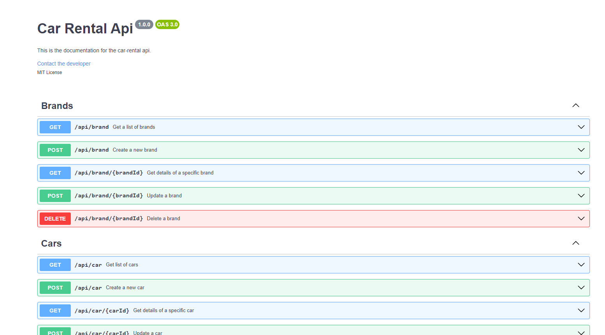

# Car Rental  
### 📝 Car rental is a full stack api rest web application made to rent cars. The application have admin and user role, only admins can create brands, car models and cars. Users only can rent cars to use. 


## 🛠️ Made with Laravel, VueJS Composer, NPM, PHP, Postgres, Swagger and Docker

## What you need to use TaskManager:

- Docker
- Docker Compose
- Git

## Initial Configuration 🚀

1. Clone this repository
   
```bash
    git clone https://github.com/WillianMafra/Car-Rental.git
```

2. Access the project directory.

``` bash
    cd Car-Rental
```

3. Install Composer dependencies.

```docker
    docker run --rm \
        -u "$(id -u):$(id -g)" \
        -v "$(pwd):/var/www/html" \
        -w /var/www/html \
        laravelsail/php83-composer:latest \
        composer install --ignore-platform-reqs
```
4. Create an alias to simplify using Sail.

```bash
    alias sail='[ -f sail ] && sh sail || sh vendor/bin/sail'
```

5. Rename the .env copy file to .env.

```bash
    mv '.env.example' .env
```

6. Initialize the Docker environment using Sail.

```bash
    sail up -d
```

7. Access the application container.

```bash
    sail shell
```
8. Generate an application key.
   
```bash
    php artisan key:generate
```

9. Run database migrations.
    
```bash
    php artisan migrate --seed
```

10. Create the jwt secret key.
    
```bash
    php artisan jwt:secret
```

10. Create the link to storage files.
    
```bash
    php artisan storage:link
```

12.  Run npm install to install Node.js dependencies and npm run dev to compile assets.
```bash
    npm install
    npm run dev
```

## Accessing the Application

After following the steps above, the Task Manager app should be up and running and accessible through the web browser at the following address:

```
http://localhost/login
```

## Stopping the Sail Environment
To stop the Sail environment, exit the application shell by typing

```bash
    exit
```
and then execute the following command in the project directory:

```bash
sail down
```

---

## 😄 Made by: 
<table>
  <tr>
    <td align="center">
      <a href="https://www.linkedin.com/in/willnmafra/" title="LinkedIn Willian">
        <br>
        <sub>
          <b>Willian Mafra</b>
        </sub>
      </a>
    </td>
  </tr>
</table>
